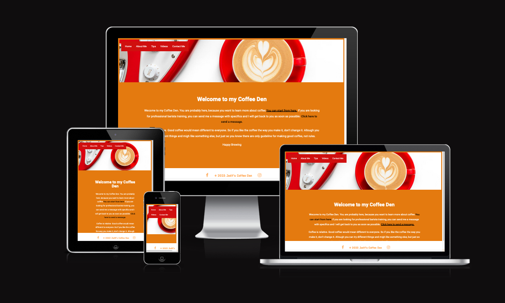

# Judit's Coffee Den

## User-Centric Frontend Development- Project 1

Judit's Coffee Den is dedicated to homebrewers who are looking for tips to improve their at home coffee experience.
The content is built around useful internal- and externail links, and a handful of youtube videos. everything you need in one place, no more researching and looking for hours on the internet.

I also offer professional training, I have over 8 years of speciality coffee management experience . I have had many successful training session from complete begginners to experienced baristas, and they all left the training with extra knowledge and more confidence. You can get in touch they can send me a message on the Contact me page.
In the future this site could grow into a professional trining website with maybe access with subscription, or a fixed rate access.

The site is easy to use and easy to find what you are looking for. If there is still doubt, or if the user needs more help with coffee related questions, they can contact me simply sending me a message.

The navigation and background is unified throughout the page, for more user firendly experience.

This project is for educational purposes and should not be used as a template.

The aim is to have an easy to use responsive website.

[Live website is availabale from GitHub's Repository](https://szelezsan.github.io/juditscoffeeden/)

# Table of contents

1. Home/ Landing Page
2. About
3. Tips
4. Videos
5. Contact me
6. Color Scheme
7. Fonts
8. Website goals
9. Long term goals
10. Structure of the website
11. Images
12. Features
13. Navigation
14. Footer
15. Technologies used
16. Functionality Testing
17. Compatibility Testing

1. Home

In this section it is a short description what can you find on the page, including direct links for different pages for easier access.

2. About

This page is including a short description of my background in speciality coffee,coffee shop development and training.
Even though I am not working currently in the hospitality sector, coffee is still my passion, and I am always happy to share my knowledge with others.

3. Tips

Basic knowledge is displayed on the page for the user for be able to indentify issues with coffee making. Pack with lots of useful links, including retail links to good filter papers and more.
This page have the most content, and will be growing overtime, as coffee is always evolving and there are always new techniques out there.

4. Videos

This section have multiple brewing techniques in one page. No more extensive searches which video will give you good steady knowledge. It is all there.
It is even including some tips for coffee ratios, espresso brew times, milk steaming technique for latte art and burr replacement for the most common home grinder the Baratza Encore.

5. Contact me

This page contains a form, where you can choose from professional or homebrewing options, and users can send me a message. All fields are required, and won't allow users to send any message without having them filled. After submitting users are directed to Code Institudes form-dump page, where they can see what they submitted. In the future I might replace this with a Thank you page.

6. Color scheme

Main colors used in the project:
* rgb(243, 140, 6)
* white
* rgb(208, 15, 15)

This color combination gives a happy, bright webpage, with good contrast and vibrant color combination.

7. Fonts

The main font I used in the project is 'Roboto' sans-serif. 

It gives an easily readable site, and makes it more stylis and a little bit more unique.

8. Website Goals

This website is for everybody, no matter if you are new to coffee or have already experience, everyone will find something for themselves.
If you ever doubdted your ciffee making skills this website is for you. 
As they say the devil is in the details, so that is what I am sharing with my audience.

9. Long term goals

This website could be turned into a profitable source of income, with no extra money invested into it. I have all the knowledge to fill it with different level of barista courses. I would implement into the website a bookimg system, where all future available training dates available. 

All professional trainings would take place on site in this case, as I am not in the position to invest into a well equipped training room.
In order to book me in for an on site training, all equpment have to be serviced a week in advance, and provide proof. 
This is cruital in order to get good results from the training.

Fees would depend the length of the training, the type of taining and the amount of people attending.

10. Structure of the website

When I first stared to work on the website I wanted to have a gallery full of my fance's beautiful photos of coffees, and a menu point for recomending coffee shops. All coffee shop would have had a photo, which if you hovered over a link to their website or social media would appear.
Due to the coding platfor malfunction I have lost a significant amount of time available for the completion of the project, and I was not able to manage all formatting, styling in time, so these features are not included.
However I managed to include a lot of useful videos from Youtube linked in and can be watch on my website or on the Youtube Channel.

The menu is not extensive, but offers everything a visitor might need, such as an About Me section, where you can read about my experience, a Tips section, which has most of the useful coffee content-there is literally all you need to investigate why your coffee is not tasting freaking good.
The video section is probably the most entertaining part, I am really glad I was able to find a nice selection of videos.

At last a Contact me section, where you can choose from professional or homebrewer options, and make it easeier on the long run to filter the messages out.

11. Images

Background image was photograped by my fiance: Gabor Labath

The coffee grind photos were sourced from (https://bigcupofcoffee.com/coffee-grind-size-chart-guide/)

12. Features

The website consist five pages, this includes a homepage,an about me, tips, videos, and a contact me section with a message form in it.

13. Navigtaion Bar

The navigation bar is sitting on a lovely pohoto. It is responsive by shrinking the menu to the size it fits on the screen.
I used a red background with white font color for good contrast, and easy readability.
All paged got a h1 header, so you know which page are you at.

14. Footer

In the footer area you'll find two social icons, so my social meda pages are easily accessable and connection can be made efortlessly.

It is important to display social site accesses as many people would feel more confortable to reach out to a person with a face and not just a nicely filled website. This way they can reach out to me on those platforms as well, expanding my connections to people and new possibilities.

15. Teachnologies used
    * HTML as a structure language
    * CSS as style language
    * Fontawesome as an icon library
    * Google Fonts as a font resource
    * GitHub as a softver hosting platform to store code and have remote access to it
    * Codeanywhere/ VScode as a development hosting platform

16. Functionality Testing
Throughout the project I used Mozzilla we developer tools for resolving responsivness and other style related issues.

17. Compatibility testing
The website was tested across Iphone 11 Pro, Ipad, Samsung phone, a very large monitor with 1920px width, and a Macbook air laptop.

18. Code Validation

Credits:
Background Photo: Gabor Labath

Some CSS features were imported from W3 Schools: (https://www.w3schools.com/howto/)

Visual coffee grind guide: (https://bigcupofcoffee.com/coffee-grind-size-chart-guide/)

Coffee hardness specifics found: (https://www.baristainstitute.com/node/275)

Code for video insertion: (https://stackoverflow.com/questions/3755007/embedded-youtube-code-does-not-validate)

Video Content : (https://Youtube.com)