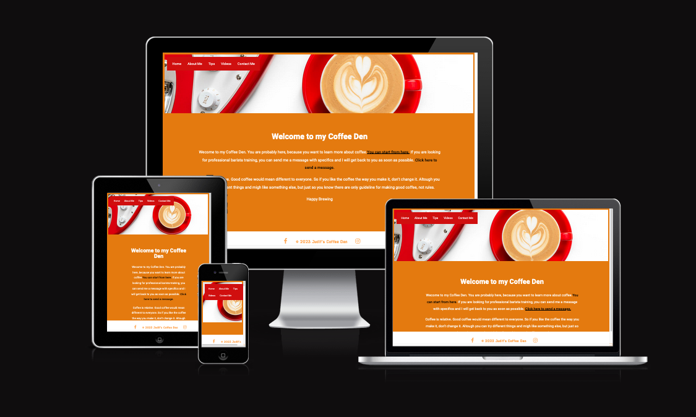

# Annie's Portfolio website

## User-Centric Frontend Development Portfolio Project1.

Website presents Annie's portfolio as a fitness instructor, personal trainer and diet coach.
Users will be able to find interesting content in easy and simple way.

This project is for educational purposes and can not be used as a template for a business use.
Main aim is to build responsive website with HTML and CSS only. I will use Bootstrap framework to keep website consent and clear.

## [View life website in github pages](https://marcin-kli.github.io/MP1/)
---

# Table of contents

- [UX](#ux)
    - [Website owner business goals](#website-owner-business-goals)
    - [User goals](#user-goals)
        - [New user goals](#new-user-goals)
        - [Returning user goals](#returning-user-goals)
        - [Website owner business goals](#website-owner-business-goals)
    - [User stories](#user-stories)
    - [Structure of the website](#structure-of-the-website)
    - [Wireframes](#wireframes)
    - [Surface](#surface)
- [Features](#features)
- [Technology](#technology)
- [Testing](#testing)
    - [Functionality testing](#functionality-testing)
    - [Compatibility testing](#compatibility-testing)
    - [Code Validation](#code-validation)
    - [User stories testing](#user-stories-testing)
    - [Issues found during site development](#issues-found-during-site-development)
    - [Performance testing](#performance-testing)
- [Deployment](#deployment)
- [Credits](#credits)
- [Screenshots](#screenshots)

# UX

## Website owner business goals

The main reason to create this website is to help present a fitness instructor to the public.
Page owner can present herself, her professional development path, achievements and top skills.
Also this website is the best place to show types of fitness classes, personal training and diet coaching descriptions.
And at the end owner will be able to present an offer with available packages and prices.

## User goals

### New user goals:
- user is able to find information about professional fitness trainer.
- user can easily locate class description, personal training sessions description and diet coaching sessions description.
- find location of the place and contact information.

### Returning user goals:
- user can learn more about instructor.
- user is able to find timetable.
- user can send a message to the instructor using a contact form.

## User stories

### As a business owner:
* I would like to present myself and my offer on the website clearly to potential customers.
* I need to make sure that my current and new customers will find a professional help with their diets, personal or group trainings.
* I want my customers to be able to learn how to use my website intuitively and easily.
* I would like to build and maintain relationship with potential and current customers.

### As a new customer:
* I wish to find information about personal trainer and check her/his qualifications.
* I would like to contact with a diet coach to change my eating habits and start healthy lifestyle. 
* I want to join in a fitness group with professional trainer, to find motivation and spend time actively.

### As a returning customer:

* I need to contact my diet coach to reschedule my meeting.
* I would like to check timetable for current days and times for a group trainings.
* I want to show my friend a location of the fitness studio where we can join for a semi private personal training.

## Structure of the website

The website is designed to be easy and user-friendy on all type of devices. On desktop, tablet or mobile device there should be no difference for a user to have a fantastic experience. All parts are designed to achieve maximum user satisfaction. User will get some interaction from the interface as links and buttons will have a hover effects.

## Wireframes

I used website wireframe.cc to create a wireframes.

## Surface

### Colors
Main colours used in a project:
* background color: #ccddff
* font color: #6217ee
* link color: #ff6600
* hoover color: #ff9000

### Fonts 

* As a main font I used Almarai, and as a backup font sans-serif

### Images

* I used images from [Unspalsh.com](www.unsplash.com) and there are credited in [credits](#credits) section.

[Back to Table of contents](#table-of-contents)
___
# Features

The website consists of 6 pages. Four are accessible from a navigation menu.
One is a 404 error page and one is a submission confirmation page for a form.

The website has below features:

## Navigation bar

* #### Navigation bar is visible on the top of each website. It is responsive and will adapt to mobile devices by a change into a burger menu.
* Navigation scheme:

    * On left side there is a logo. It can be used as navigation link to the main page.
    * On right side there are four links or burger menu. It contains:
        * Home
        * About me
        * Offer
        * Contact

## Timetable

* Each site has a timetable on the bottom. Customers can find classes times here.

## Footer

* Footer is consistent on all pages. It has contact details on left side and social links on right side.
Each link will open in a separate tab in a browser.

## Home

* ### Portfolio section

    * Portfolio includes an image on the left side and profession information on the right side.
This section is consistent on all pages.

* ### Career path section

    * Career path section contains top achievements and career  points. It is presented as a timeline.

* ### Packages section

    * This part has three packages to choose for a customers. All buttons are linked to offer site.

## About me

* About me gives information about Annie's life and her professional background.

## Offer

* This site provide packages description to customers.
Here they can find more information and choose interesting offer.

## Contact

* Contact form is a main part on this site. User can contact by filling a form with interesting topic.
Below a form there is a map with location of a fitness studio.

##  Future implementations

* Create diet coach offer.
* Add new site with class descriptions.
* A blog site with fitness advises.
* Login site for paid content including videos, meals ideas and recipes.

[Back to Table of contents](#table-of-contents)
___
# Technologies used

### HTML5
* As a structure language.

### CSS
* As a style language.

### Bootstrap 
* Bootstrap@4.5.3 as a CSS framework to keep responsive, mobile first aproach.

### Font Awesome
* As an icon library for a social links.

### Google fonts
* As a font resource.

### GitHub
* As a software hosting platform to keep project in a remote location.

### Git
* As a version-control system tracking.

### Gitpod
* As a development hosting platform.

### Wireframe.cc
* As a wireframing tool.

### GNU Image Manipulation Program [GIMP]
* As an image editor.

[Back to Table of contents](#table-of-contents)

___
# Testing

## Functionality testing 

 I used Mozilla web developer tools and Chrome developer tools throughout the project for testing and solving problems with responsiveness and style issues.
 
 [Unicorn Revealer](https://chrome.google.com/webstore/detail/unicorn-revealer/lmlkphhdlngaicolpmaakfmhplagoaln?hl=en-GB) extension to chrome browser was very helpful.

## Compatibility testing
 Site was tested across multiple virtual mobile devices and browsers. I checked all supported devices in both Mozilla web developer tolls and Chrome developer tools. 
 
 I tested on hardware devices such as: Lenovo ideapad with Ubuntu and Windows OS's, Lenovo smartphone with Android 7, Google pixel 3 with Android 11.

## User stories testing

### As a business owner:

- I would like to present myself and my offer on the website clearly to potential customers.
    > Name, photo of the instructor and top skills are on each page in portfolio section. Career path section at home page provides more details.

- I need to make sure that my current and new customers will find a professional help with their diets, personal or group trainings.
    > Customers can achieve this by contacting through contact form. They can choose interesting topic and describe their needs in a message box.

- I want my customers to be able to learn how to use my website intuitively and easily.
    > Each site has a fixed navigation menu and is accessible at all times. All content is presented with minimalistic approach.

- I would like to build and maintain relationship with potential and current customers.
    > Customers are able to find a links to social channels at the bottom of each page. Alternatively they can contact by email or contact form.

### As a new customer:
- wish to find information about personal trainer and check her/his qualifications.
    > User can see essential description on the home page. More information can be find in about page.

- I would like to contact with a diet coach to change my eating habits and start healthy lifestyle.
    > User can find a contact form in contact page. Alternatively can use an email. Email address if located in a footer the bottom of each page.

- I want to join in a fitness group with professional trainer, to find motivation and spend time actively.
    > Brief class description of fitness group classes can be find on the home page below career path section. Offer site provides more detailed description. Frome there user can click contact us button and send a message to the traier.

### As a returning customer:
- I need to contact my diet coach to reschedule my meeting.
    > User can find a contact form in contact page. Alternatively can use social channels or email.

- I would like to check timetable for current days and times for a group trainings.
    > Each site has time table at the bottom of the page.

- I want to show my friend a location of the fitness studio where we can join for a semi private personal training.
    > Each page contains location information in a footer. Users are able to find a location map in contact page.

---
## Issues found during site development

* #### Horizontal scrolling bar on the bottom of the screen.

I used [grid markup](https://getbootstrap.com/docs/4.5/components/card/#header-and-footer)
to create two sepereate collumns. To achieve this I had to use *.row* in first *div* element and *.col-sm-6* in the second *div* element.
After that I found that horizontal scrolling bar appear on the bottom of the screen.
Using mozilla developer tools I noticed that by default class *.row* has *margin-right: -15px;* and *margin-left: -15px;*

To fix this I created new class *.no-row-margin* and set both margins to 0px.

> After I gain more experience with bootstrap I found that I could achive this by [no-gutters](https://getbootstrap.com/docs/4.0/layout/grid/#no-gutters) class.

> I read bootstrap documentation about [Spacing](https://getbootstrap.com/docs/4.0/utilities/spacing/) and I decided to use predefined classes for paddings and margins in the project.
By doing this I think my code looks cleaner and will be easier to understand by other developers.

* #### Ipad screen compatibility

I found a bugs on Ipad screens. I would like to keep years dates just above the stars, but they were shifted.

I had to create a block element with a class "ipad-screen" and non-breaking space element inside a block element.
In CSS file I had to create @media rule that will show this block element on Ipad displays only.

>}
@media screen and (max-width: 991px) and (min-width: 0px),(min-width:1200px){
    .ipad-screen {
    display: none;
}
}

## Performance testing

I run [Lighthouse](https://developers.google.com/web/tools/lighthouse/) tool to check performance of the website.
I had to do couple of changes to improve performance. Screenshots are presented below:

Final results:

I noticed that this tests scores vary from time to time and depends on external libraries as well. 

## Code Validation
 At the and of the project I used two websites to validate a code
 
 * [W3C CSS Validator](https://jigsaw.w3.org/css-validator/) to validate CSS
 * [Nu Html Checker](https://validator.w3.org/) to test HTML

[Back to Table of contents](#table-of-contents)

___
# Deployment

The project was deployed on GitHub Pages. I used Gitpod as a development environment where I commited all changes to git version control system.
I used push command in Gitpod to save changes into GitHub.

To deploy a project I had to:

* Log in to GitHub and click on repository to deploy ([MP1](https://github.com/marcin-kli/MP1))
* select `Settings` and find GitHub Pages section at the very bottom of the page
* from source select `none` and then `Milestone-Projects` branch.
* click `save` and page was deployed after auto-refresh.
>  Your site is published at https://marcin-kli.github.io/MP1/

To run localy:
* Log in to GitHub and click on repository to download ([MP1](https://github.com/marcin-kli/MP1))
* select `Code` and click Download the ZIP file.
* after download you can extract the file and use it in your local environment 

Alternatively you can [Clone](https://docs.github.com/en/free-pro-team@latest/github/creating-cloning-and-archiving-repositories/cloning-a-repository)
or [Fork](https://docs.github.com/en/free-pro-team@latest/github/getting-started-with-github/fork-a-repo)
this repository ([MP1](https://github.com/marcin-kli/MP1)) into your github account.

[Back to Table of contents](#table-of-contents)
___
# Credits

* To complete this project I used Code Institute student template: [gitpod full template](https://github.com/Code-Institute-Org/gitpod-full-template)

* Ideas and knowledge library:

    * [w3schools.com](https://www.w3schools.com)

    * [css-tricks.com](https://css-tricks.com/)

    * [getbootstrap.com/docs](https://getbootstrap.com/docs/4.5/getting-started/introduction/)
        I used code for navbar, jumbotron and card from Bootstrap.

### Code

* Links transition: [CSS transition Property](https://www.w3schools.com/cssref/css3_pr_transition.asp)
* Bootstrap: [Kitchen sink](https://getbootstrap.com/docs/4.0/components/card/#kitchen-sink)
* Bootstrap: [Burger menu](https://getbootstrap.com/docs/4.5/components/navbar/#text)
* Bootstrap: [Jumbotron](https://getbootstrap.com/docs/4.5/components/jumbotron/)
* Bootstrap: [Form](https://getbootstrap.com/docs/4.5/components/forms/)
### Content:
*  General content:  [fitlife.ie](http://fitlife.ie/lessons-its-your-life-your-fit-life/)

### Map location:
* [fitlife.ie](http://fitlife.ie/)

### Map:
* [Google maps](https://www.google.com/maps?ll=52.059441,-9.511501&z=16&t=m&hl=en-US&gl=US&mapclient=embed&cid=7306226195280410511)

### Images:

#### Unsplash.com:
* [annie-spratt--l-eemJU0vE-unsplash.jpg](https://unsplash.com/photos/-l-eemJU0vE)

* [ziphaus-SZ40Lbw1P5o-unsplash.jpg](https://unsplash.com/photos/SZ40Lbw1P5o)

* [bruce-mars-y0SMHt74yqc-unsplash.jpg](https://unsplash.com/photos/y0SMHt74yqc)

* [luis-quintero-EPrjIYQrpkU-unsplash.jpg](https://unsplash.com/photos/EPrjIYQrpkU)

* [sven-scheuermeier-saGbrA6s8g0-unsplash.jpg](https://unsplash.com/photos/saGbrA6s8g0)

[Back to Table of contents](#table-of-contents)
___

# Screenshots

## Project screenshots

[Back to Table of contents](#table-of-contents)
___

# Judit's Coffee Den

## User-Centric Frontend Development- Project 1

Judit's Coffee Den is dedicated to homebrewers who are looking for tips to improve their at home coffee experience.
The content is built around useful internal- and externail links, and a handful of youtube videos. everything you need in one place, no more researching and looking for hours on the internet.

I also offer professional training, I have over 8 years of speciality coffee management experience . I have had many successful training session from complete begginners to experienced baristas, and they all left the training with extra knowledge and more confidence. You can get in touch they can send me a message on the Contact me page.
In the future this site could grow into a professional trining website with maybe access with subscription, or a fixed rate access.

The site is easy to use and easy to find what you are looking for. If there is still doubt, or if the user needs more help with coffee related questions, they can contact me simply sending me a message.

The navigation and background is unified throughout the page, for more user firendly experience.

This project is for educational purposes and should not be used as a template.

The aim is to have an easy to use responsive website.

[Live website is availabale from GitHub's Repository](https://szelezsan.github.io/juditscoffeeden/)

# Table of contents

1. Home/ Landing Page
2. About
3. Tips
4. Videos
5. Contact me
6. Color Scheme
7. Fonts
8. Website goals
9. Long term goals
10. Structure of the website
11. Images
12. Features
13. Navigation
14. Footer
15. Technologies used
16. Functionality Testing
17. Compatibility Testing

1. Home

In this section it is a short description what can you find on the page, including direct links for different pages for easier access.

2. About

This page is including a short description of my background in speciality coffee,coffee shop development and training.
Even though I am not working currently in the hospitality sector, coffee is still my passion, and I am always happy to share my knowledge with others.

3. Tips

Basic knowledge is displayed on the page for the user for be able to indentify issues with coffee making. Pack with lots of useful links, including retail links to good filter papers and more.
This page have the most content, and will be growing overtime, as coffee is always evolving and there are always new techniques out there.

4. Videos

This section have multiple brewing techniques in one page. No more extensive searches which video will give you good steady knowledge. It is all there.
It is even including some tips for coffee ratios, espresso brew times, milk steaming technique for latte art and burr replacement for the most common home grinder the Baratza Encore.

5. Contact me

This page contains a form, where you can choose from professional or homebrewing options, and users can send me a message. All fields are required, and won't allow users to send any message without having them filled. After submitting users are directed to Code Institudes form-dump page, where they can see what they submitted. In the future I might replace this with a Thank you page.

6. Color scheme

Main colors used in the project:
* Backgroundcolor: rgb(243, 140, 6)
* Footer color, font color: #ffffff
* Navigation background color: rgb(208, 15, 15)
* Link colors: #000000

This color combination gives a happy, bright webpage, with good contrast and vibrant color combination.

7. Fonts

The main font I used in the project is 'Roboto' sans-serif. 

It gives an easily readable site, and makes it more stylis and a little bit more unique.

8. Website Goals

This website is for everybody, no matter if you are new to coffee or have already experience, everyone will find something for themselves.
If you ever doubdted your ciffee making skills this website is for you. 
As they say the devil is in the details, so that is what I am sharing with my audience.

9. Long term goals

This website could be turned into a profitable source of income, with no extra money invested into it. I have all the knowledge to fill it with different level of barista courses. I would implement into the website a bookimg system, where all future available training dates available. 

All professional trainings would take place on site in this case, as I am not in the position to invest into a well equipped training room.
In order to book me in for an on site training, all equpment have to be serviced a week in advance, and provide proof. 
This is cruital in order to get good results from the training.

Fees would depend the length of the training, the type of taining and the amount of people attending.

10. Structure of the website

When I first stared to work on the website I wanted to have a gallery full of my fance's beautiful photos of coffees, and a menu point for recomending coffee shops. All coffee shop would have had a photo, which if you hovered over a link to their website or social media would appear.
Due to the coding platfor malfunction I have lost a significant amount of time available for the completion of the project, and I was not able to manage all formatting, styling in time, so these features are not included.
However I managed to include a lot of useful videos from Youtube linked in and can be watch on my website or on the Youtube Channel.

The menu is not extensive, but offers everything a visitor might need, such as an About Me section, where you can read about my experience, a Tips section, which has most of the useful coffee content-there is literally all you need to investigate why your coffee is not tasting freaking good.
The video section is probably the most entertaining part, I am really glad I was able to find a nice selection of videos.

At last a Contact me section, where you can choose from professional or homebrewer options, and make it easeier on the long run to filter the messages out.

11. Images

Background image was photograped by my fiance: Gabor Labath

The coffee grind photos were sourced from (https://bigcupofcoffee.com/coffee-grind-size-chart-guide/)

12. Features

The website consist five pages, this includes a homepage,an about me, tips, videos, and a contact me section with a message form in it.

13. Navigtaion Bar

The navigation bar is sitting on a lovely pohoto. It is responsive by shrinking the menu to the size it fits on the screen.
I used a red background with white font color for good contrast, and easy readability.
All paged got a h1 header, so you know which page are you at.

14. Footer

In the footer area you'll find two social icons, so my social meda pages are easily accessable and connection can be made efortlessly.

It is important to display social site accesses as many people would feel more confortable to reach out to a person with a face and not just a nicely filled website. This way they can reach out to me on those platforms as well, expanding my connections to people and new possibilities.

15. Teachnologies used
    * HTML as a structure language
    * CSS as style language
    * Fontawesome as an icon library
    * Google Fonts as a font resource
    * GitHub as a softver hosting platform to store code and have remote access to it
    * Codeanywhere/ VScode as a development hosting platform

16. Functionality Testing
Throughout the project I used Mozzilla we developer tools for resolving responsivness and other style related issues.

17. Compatibility testing
The website was tested across Iphone 11 Pro, Ipad, Samsung phone, a very large monitor with 1920px width, and a Macbook air laptop.

18. Code Validation
All html and css codes are validated there are no error or warnings.

Credits:
Background Photo: Gabor Labath

Some CSS features were imported from W3 Schools: (https://www.w3schools.com/howto/)

Visual coffee grind guide: (https://bigcupofcoffee.com/coffee-grind-size-chart-guide/)

Coffee hardness specifics found: (https://www.baristainstitute.com/node/275)

Code for video insertion: (https://stackoverflow.com/questions/3755007/embedded-youtube-code-does-not-validate)

Video Content : (https://Youtube.com)

Hamburger menu: https://reintech.io/blog/creating-responsive-hamburger-menu-button-with-css

Background Photo: https://www.pexels.com/photo/white-mug-on-red-background-2916450/

Media queries: https://gist.github.com/gokulkrishh/242e68d1ee94ad05f488